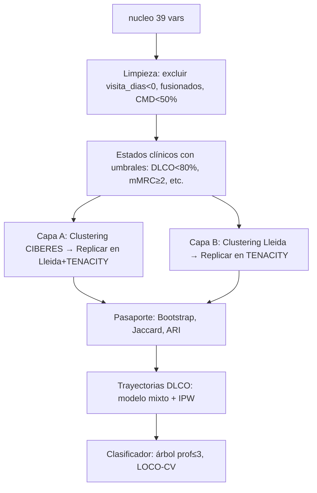

# 📊 Análisis Exploratorio Inicial — Reto 2: Fenotipado Post-Infeccioso

> ⚠️ **Cumplimiento ético**: Este análisis solo muestra **resultados agregados**.  
> No se ha visualizado ninguna fila de paciente individual. Todo N < 10 debe suprimirse antes de publicarse.

---

## 1. Estructura de ficheros

| Fichero | Tamaño | Descripción |
|---|---|---|
| `cohorte_unificada_nucleo.csv` | 1.8 MB | **9.809 × 39** — 24 vars armonizadas + trazabilidad. **Punto de entrada.** |
| `cohorte_unificada.csv` | 67 MB | **9.809 × 4.956** — Tabla completa con todas las visitas. Solo usar cuando se sepa qué columnas se necesitan. |
| `diccionario_variables_reto2.xlsx` | 370 KB | 5 hojas: Léeme, Núcleo, Todas las variables (4.955 filas), Cobertura por dominio, Visitas. |

---

## 2. Universo de pacientes

```
Total pacientes únicos: 9.809
```

| Registro | N en registro | N como fila principal | Procedencia |
|---|---|---|---|
| CIBERESUCICOVID | 9.274 | 9.274 | + 459 solapan con Lleida/VdR |
| POSTCOVID-Lleida | 624 | 187 (377 → CIBERES) | 437 fusionados en CIBERES, 187 solo-Lleida |
| TENACITY | 287 | 287 | Sin solapamiento |
| Virgen del Rocío | 83 | 61 | 22 fusionados en CIBERES |

> **Clave operativa**: Para filtrar pacientes de un registro, usar `en_<REGISTRO>`, **no** la columna `cohorte`.  
> Los 437 pacientes `fusionada_lleida == 1` deben excluirse de **uno** de los dos lados al validar Lleida ↔ CIBERESUCICOVID.

---

## 3. Variables del núcleo (39 columnas)

### 3.1 Bloques temáticos

| Bloque | Variables | Cobertura |
|---|---|---|
| **Trazabilidad** | `subject_id`, `cohorte`, `origen`, `centro_id`, `provincia_id`, banderas `en_*`, `fusionada_lleida`, `enriquecida_vrocio` | 100% |
| **Sociodemografía** | `sexo`, `edad_tramo5` | ~94–95% |
| **Fase aguda** | `estancia_hosp_dias`, `nu_ingreso_uci`, `nu_sdra`, `nu_iot`, `nu_traqueo`, `nu_exitus_hosp` | Variable (ver §4) |
| **Comorbilidad basal** | `nu_hta`, `nu_diabetes`, `nu_card_cronica`, `nu_pulm_cronica`, `nu_epoc`, `nu_asma`, `nu_renal_cronica`, `nu_ictus_previo`, `nu_sahs`, `nu_tabaquismo` | Variable (ver §4) |
| **Función respiratoria** | `nu_fvc_pct_seg`, `nu_fev1_pct_seg`, `nu_dlco_pct_seg` | 13–20% (solo quien tuvo visita) |
| **Esfuerzo y síntomas** | `nu_pm6m_metros_seg`, `nu_disnea_mmrc_seg` | 8–9% |
| **Temporal** | `visita_dias`, `nu_fecha_ingreso`, `nu_fecha_alta`, `nu_fecha_visita1` | 28–90% |

### 3.2 Demografía

| Variable | Detalle |
|---|---|
| **Sexo** (0=H, 1=M) | H: 70.3%, M: 29.7%, Missing: 5.6% |
| **Edad tramo5** | Pico en 60–74 años. Tramos heterogéneos (mezcla de rangos entre registros) |
| **Tabaquismo** | No: 56.1%, Ex-fumador (2): 29.4%, Sí (1): 6.8%, Missing (9): 7.6% |

### 3.3 Gravedad del episodio agudo

| Variable | Prevalencia | Missing |
|---|---|---|
| Ingreso UCI | **88.5%** (de los que tienen dato) | 0% |
| SDRA | 96.9% (de los que tienen dato) | 92.9% — ⚠️ casi solo TENACITY lo recoge |
| IOT | 47.6% (de los que tienen dato) | **99.2%** — prácticamente inutilizable en nucleo |
| Traqueotomía | 29.6% (de los que tienen dato) | 26.0% |
| Estancia hospitalaria | Mediana **24 días**, Media 31.8 días | 13.1% |
| Exitus hospitalario | 31.4% (de los que tienen dato, código 9=desconocido en n<10) | 27.6% |

> **UCI**: el 88.5% de los pacientes con dato ingresaron en UCI. Esto refleja el sesgo de selección de estas cohortes (pacientes graves). CIBERESUCICOVID y TENACITY son poblaciones post-UCI principalmente.

---

## 4. Mapa de ausencias clave

```
Alta ausencia (> 90%):
  nu_iot              99.2%  ← inutilizable en nucleo
  nu_ictus_previo     96.2%  ← solo cohortes menores
  nu_sahs             96.2%  ← solo cohortes menores
  nu_sdra             92.9%
  nu_pm6m_metros_seg  91.8%  ← no en CIBERESUCICOVID
  nu_disnea_mmrc_seg  91.3%  ← no en CIBERESUCICOVID
  nu_asma             90.2%
  nu_dlco_pct_seg     82.9%  ← VARIABLE PRINCIPAL de trayectorias

Ausencia moderada (25–82%):
  nu_fev1_pct_seg     80.7%
  nu_fvc_pct_seg      80.6%
  visita_dias         71.9%  ← solo quien tuvo ≥1 visita
  nu_exitus_hosp      27.6%

Buena cobertura (< 15%):
  nu_hta, nu_diabetes, nu_epoc, nu_renal_cronica  ~9%
  estancia_hosp_dias  13.1%
  edad_tramo5          5.2%
```

> ⚠️ **Ausencia estructural vs. no cumplimentado**: lo que una cohorte no recoge (e.g. PM6M en CIBERES) ≠ dato perdido aleatorio. **Nunca imputar ausencias estructurales**.

---

## 5. Variable principal: DLCO (% predicho)

La DLCO es el **eje central** del análisis de trayectorias según el Planning_Inicial.

| Estadístico | Valor |
|---|---|
| N con medida | 1.681 pacientes (17.1% del total) |
| Mediana | 71.2% |
| Media | 72.0% |
| DLCO < 80% | **66.2%** — mayoría con afectación |
| DLCO < 70% | 46.0% |
| DLCO < 60% | 25.0% |

### DLCO por cohorte

| Cohorte | N | Mediana DLCO |
|---|---|---|
| CIBERESUCICOVID | 1.289 | 71.0% |
| POSTCOVID-Lleida | 176 | 68.7% |
| TENACITY | 177 | **80.0%** |
| Virgen del Rocío | 39 | **59.0%** |

> **Nota interpretativa** (equipo): <!-- TODO equipo: interpretación clínica de diferencias entre cohortes -->

---

## 6. Estructura temporal — visitas por registro

| Registro | Visita | Momento nominal | N con datos | % del registro | N con función resp. |
|---|---|---|---|---|---|
| CIBERESUCICOVID | M3_ | 3m | 3.744 | 40.4% | 1.226 |
| CIBERESUCICOVID | M6_ | 6m | 3.364 | 36.3% | 1.177 |
| CIBERESUCICOVID | A1_ | 12m | 3.303 | 35.6% | 773 |
| POSTCOVID-Lleida | LV1_ | 3m | 497 | 79.6% | 474 |
| POSTCOVID-Lleida | LV2_ | 6m | 431 | 69.1% | 393 |
| POSTCOVID-Lleida | LA1_ | 12m | 379 | 60.7% | 305 |
| POSTCOVID-Lleida | LM18_ | 18m | 28 | 4.5% | 25 |
| POSTCOVID-Lleida | LM24_ | 24m | 340 | 54.5% | 326 |
| POSTCOVID-Lleida | LA3_ | 36m | 93 | 14.9% | 84 |
| POSTCOVID-Lleida | LA4_ | 48m | 30 | 4.8% | 30 |
| TENACITY | M3_ | 3m | 215 | 74.9% | 159 |
| TENACITY | M6_ | 6m | 145 | 50.5% | 63 |
| TENACITY | A1_ | 12m | 130 | 45.3% | 68 |
| Virgen del Rocío | visita 1 | 1m | 82 | 98.8% | 63 |
| Virgen del Rocío | visita 2 | 6m | ≤10 | 10.8% | ≤10 |

> ⚠️ **Ventana común para comparación entre cohortes**: 0–12 meses.  
> Más allá del año: **solo Lleida** tiene seguimiento relevante. Presentar por separado, sin extrapolar.

### Prefijos de columnas en la tabla completa (4.956 columnas)

| Prefijo | N cols | Corresponde a |
|---|---|---|
| `AH_` | 418 | Alta hospitalaria |
| `M3_` | 416 | Visita 3 meses (CIBERES + TENACITY) |
| `M6_` | 413 | Visita 6 meses |
| `A1_` | 389 | Visita 12 meses |
| `LA1_` | 323 | Lleida año 1 |
| `LM24_` | 320 | Lleida mes 24 |
| `IH_` | 311 | Ingreso hospitalario (CIBERES) |
| `LA3_` | 302 | Lleida año 3 |
| `LA4_` | 302 | Lleida año 4 |
| `LV1_` | 228 | Lleida visita 1 (~3m) |
| `LV2_` | 222 | Lleida visita 2 (~6m) |
| `LM18_` | 221 | Lleida mes 18 |
| `IU_` | 197 | Ingreso UCI |
| `BASE` | 185 | Variables base sin prefijo |
| `LFA_` | 103 | Lleida fase aguda |

---

## 7. Dominios clínicos en la tabla completa

| Dominio | N variables |
|---|---|
| Analítica | 596 |
| Sueño (cuestionarios) | 479 |
| Gravedad episodio agudo | 462 |
| Calidad de vida | 381 |
| Función respiratoria | 349 |
| Imagen torácica | 306 |
| Síntomas persistentes | 180 |
| Actigrafía y ritmos circadianos | 171 |
| Ansiedad y depresión (HADS) | 166 |
| Comorbilidad basal | 122 |
| Cognición | 88 |
| Función física | 48 |
| Prueba de esfuerzo (PM6M) | 31 |

> **Cobertura por capa de análisis**:
> - **Capa A (respiratoria)**: Función respiratoria + Imagen torácica → presente en las 4 cohortes
> - **Capa B (multidominio)**: HADS, Calidad de vida, Cognición, Sueño → **solo Lleida y TENACITY**

---

## 8. Comorbilidades basales

| Comorbilidad | Sí | No | Missing |
|---|---|---|---|
| HTA | 49.7% | 50.3% | 9.2% |
| Diabetes | 24.4% | 75.6% | 9.3% |
| Cardiopatía crónica | 13.7% | 86.3% | **25.9%** |
| Enfermedad pulmonar | 10.2% | 89.8% | 10.8% |
| Insuficiencia renal | 6.7% | 93.3% | 9.2% |
| EPOC | 4.7% | 95.3% | 9.2% |
| Asma | 5.4% | 94.6% | **90.2%** ← casi no recogida |
| SAHS | 7.9% | 92.1% | **96.2%** ← inutilizable |
| Ictus previo | 2.2% | 97.8% | **96.2%** ← inutilizable |

---

## 9. Eje temporal (visita_dias)

| Estadístico | Valor |
|---|---|
| N con visita_dias | 2.753 |
| Rango | -334 a 807 días |
| **Negativos (posibles errores)** | **54 registros** ← revisar antes de modelar |
| En ventana 60–210 días | 2.071 (75.2% de los que tienen dato) |

> ⚠️ Hay **54 valores negativos** en `visita_dias`. Deben revisarse o excluirse en el pipeline de limpieza.

---

## 10. Alertas y decisiones para el notebook

### 🔴 Críticas (bloquean el análisis)
1. **54 valores negativos en `visita_dias`** → definir criterio de exclusión en `config.yaml`
2. **Nu_iot 99.2% missing en nucleo** → no incluir en clustering; consultar en tabla completa solo para descriptivo
3. **Fusionados Lleida** (437) → excluir de uno de los lados en validación cruzada

### 🟡 Importantes (afectan la validez)
4. **DLCO solo disponible en 17% del total** → el análisis de trayectorias es sobre subconjunto con seguimiento
5. **Abandono informativo** → quien no vuelve al año tenía DLCO más alta (73.4% vs 65.2% según planning). Implementar IPW.
6. **Tramos de edad heterogéneos** entre registros → considerar reagrupar (< 50, 50–64, 65–74, ≥ 75)
7. **Tabaquismo**: código `9` = desconocido (7.6%), no es `NaN` → manejar correctamente

### 🟢 Confirmadas / correctas
8. **Capa A** puede descubrirse en CIBERESUCICOVID y replicarse en Lleida+TENACITY
9. **Capa B** debe descubrirse en Lleida y replicarse en TENACITY (con mucho cuidado por N=287)
10. **Virgen del Rocío**: solo visita al mes → uso complementario, no trayectorias

---

## 11. Recomendación de orden de trabajo



> **Siguiente paso sugerido**: Crear `src/datos_sinteticos.py` con el mismo esquema que el núcleo para poder desarrollar y testear el pipeline sin tocar datos reales.
